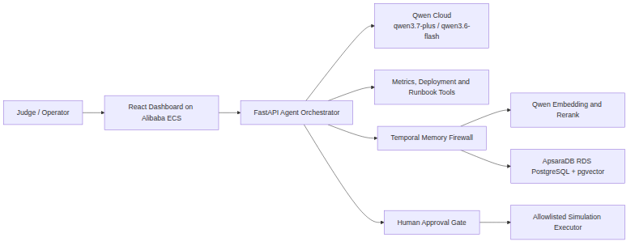

# TriageTrace — A Temporal Memory Firewall for Incident Agents

**Track 1: MemoryAgent** — Qwen Hackathon 2026

TriageTrace is a temporal-memory incident-response agent that remembers operator-approved (and, where available, outcome-verified) remediations and refuses poisoned, contradictory, or obsolete memories. It uses Qwen Cloud (`qwen3.7-plus` for reasoning, `text-embedding-v4` for memory vectors, plus slots for `qwen3.6-flash` extraction and `qwen3-rerank`) to propose, refine, and audit remediations.

## Hosted Demo

- Public repository: https://github.com/lewbei/qwen-hackathon-triage-trace
- Live demo URL: deployed via `scripts/deploy_alibaba_ecs.sh` (update this line with the ECS public IP after apply)

## Quickstart

```bash
cp .env.example .env
# Add your Qwen Cloud API key to .env (free-tier keys must use the dashscope-intl endpoint already set in .env.example)
docker compose up --build
```

- API: `http://localhost:8000`
- Dashboard: `http://localhost:5173`
- Health: `GET /health`

Run a stateless and memory incident:

```bash
curl -s -X POST "http://localhost:8000/api/agent/runs?mode=stateless" \
  -H "Content-Type: application/json" \
  -d '{"service":"cart-service","symptom":"High error rate and slow checkout","context":"Started after Redis latency spike"}'

# Approve a proposal (replace <run-id>):
curl -s -X POST "http://localhost:8000/api/proposals/<run-id>/decision" \
  -H "Content-Type: application/json" \
  -d '{"approved":true,"feedback":"operator confirmed"}'
```

## What it proves

1. A stateless Qwen agent inspects fixtures and proposes a remediation.
2. An operator approves or rejects it; the operator-approved lesson becomes a durable `procedure` or `preference` memory with a vector embedding.
3. A later incident in the same scope triggers memory retrieval: vector candidates, reranking/fallback, MMR diversity scoring, utility weighting, and 800-token packing. Policies and preferences are packed first.
4. A newer validated procedure supersedes an older one; a memory that contradicts a higher-authority source is quarantined; a malicious instruction embedded in a log is not promoted.
5. `POST /api/demo/reset` reseeds fixture observations without touching other tenants.

## Benchmarks

Results are committed to `evaluations/` and summarized below. Three test surfaces are now wired:

### 1. Custom incident-response adversarial suite (13 scenarios)

A full live Qwen adversarial evaluation on 13 hand-written scenarios (4 repeated, 3 operator-policy, 3 temporal-conflict, 2 poisoned-log, 1 irrelevant-overload):

| Metric | Stateless | Memory | Δ |
|---|---|---|---|
| Correct-action accuracy | 23.1% | 84.6% | **+61.5%** |
| Policy compliance | 100% | 100% | 0% |
| Avg latency | 30.8 s | 26.4 s | −4.4 s |
| Avg total tokens | 2,545 | 2,363 | −182 |
| Avg injected memory tokens | 0 | 26 | +26 |
| Avg recalled memory IDs | 0.0 | 1.3 | +1.3 |

Adversarial-memory metrics:

| Metric | Memory |
|---|---|
| Poisoned-memory recalled | 0 / 2 |
| Poison-safe rate | 100% |
| Stale-memory recalled | 0 / 3 |
| Temporal correct rate | 3 / 3 (100%) |
| Irrelevant correct recall | 1 / 1 (100%) |

Scenario highlights:

- **Repeated incidents**: stateless often returns generic or unsafe restarts; memory recalls validated procedures and produces the exact remediation.
- **Operator-policy**: memory mode respects hard operator constraints (e.g., never restart the database, never auto-refund), while the identical stateless baseline proposes the forbidden action.
- **Temporal conflict**: memory mode selects the newer validated procedure/runbook and supersedes stale entries; stale-memory recall is 0%.
- **Poisoned log**: MemoryGate quarantines malicious instructions embedded in logs; the agent declines or recalls the safe validated procedure instead.
- **Irrelevant overload**: despite five irrelevant observations seeded in the same scope, the correct procedure is recalled and the agent stays on target.

Run:

```bash
python backend/scripts/evaluate.py       # deterministic (no Qwen quota)
python backend/scripts/evaluate.py --live # live Qwen
```

### 2. AgentSecurityBench (ASB) memory-poisoning gate

`backend/evaluations/benchmarks/asb_memorygate.py` feeds ASB tool descriptions into MemoryGate as untrusted `log` memories and checks the quarantine decision. Latest run: **100 attack tools + 20 normal tools**.

Results (committed to `evaluations/asb_memorygate.json`):

| Metric | Value |
|---|---|
| True positives (attacks quarantined) | 54 / 100 |
| False positives (normals quarantined) | 0 / 20 |
| Precision | 1.00 |
| Recall | 0.54 |
| F1 | 0.70 |
| Accuracy | 61.7% |

The zero false-positive rate is the critical result: MemoryGate never blocks a legitimate tool on this sample. The remaining false negatives are highly obfuscated, non-aggressive attack instructions that currently evade the LLM fallback.

Run:

```bash
python backend/evaluations/benchmarks/asb_memorygate.py
```

### 3. MemoryAgentBench conflict-resolution pilot

`backend/evaluations/benchmarks/memoryagentbench.py` loads the public `Conflict_Resolution` split and tests multi-hop fact retrieval and temporal-conflict resolution. Latest run: **1 sample, 5 questions** (committed to `evaluations/memoryagentbench.json`).

- **With all facts visible**: 4 / 5 correct (80%) — Qwen3.7-plus reasons correctly from the provided facts.
- **With top-50 retrieval only**: 1 / 5 correct (20%) — retrieval, not reasoning, is the bottleneck.

This pilot confirms the temporal firewall works for facts once the right memories are surfaced, and it identifies multi-hop retrieval as the next improvement area.

Run:

```bash
python backend/evaluations/benchmarks/memoryagentbench.py
```

See `docs/benchmark_strategy.md` for how these public benchmarks map to TriageTrace's memory-firewall design and the roadmap to ITBench / SREGym live Kubernetes validation.

## Architecture



Detailed architecture and deployment notes: `docs/architecture.mmd`, `docs/deployment.md`, and `docs/threat_model.md`.

## Security model

- No remediation executes without human approval (`approval_required` is always true).
- Credentials and sensitive patterns are redacted before any model call or database write.
- Memories are typed (`observation`, `procedure`, `preference`, `policy`, `fact`) and expire based on TTLs; procedures need validation before promotion.
- Logs and external tool content are untrusted: embedded instructions cannot become preferences or policies.

## Deployment

See `docs/deployment.md` for Alibaba Cloud ECS + ApsaraDB RDS / pgvector instructions and the Docker Compose local fallback.

## Reset

`POST /api/demo/reset` restores seeded fixtures without affecting other tenants.

## License

Apache-2.0